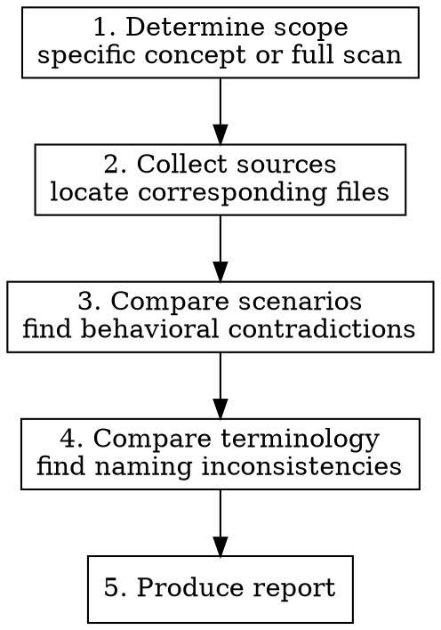

# Consistency Check

Cross-reference BDD feature files (`.feature`), OpenSpec specifications (`spec.md`), and documentation (docs) to surface scenario contradictions and terminology inconsistencies. This skill produces a report — it does not modify any files.

## Why This Skill Exists

typemd's behavior is defined across three sources with different purposes:

- **BDD feature files** (`core/features/*.feature`) — Executable behavior specs in Gherkin syntax. Evidence of what the code actually does.
- **OpenSpec specs** (`openspec/specs/*/spec.md`) — Requirements in RFC 2119 language (SHALL/MUST/MAY). The authoritative source for what features should do.
- **Documentation** (`websites/docs/src/content/docs/`) — User-facing explanations. What users are told features do.

These should stay aligned, but drift happens as development iterates: OpenSpec adds a requirement without a BDD scenario, docs describe behavior differently from tests, or the same concept gets different names in different places.

The goal is to **systematically surface contradictions**, not fix them — the user decides what to do next.

## Usage

The user can specify scope or request a full scan:

- Scoped: "Check consistency for relations" → only compare relation-related files
- Full scan: "Do a full consistency check" → scan all concept areas

## Process



### 1. Determine Scope

Identify which concept areas to check. Use this mapping to locate corresponding files across the three sources:

| Concept Area | BDD feature files | OpenSpec specs | Docs (en) |
|-------------|-------------------|----------------|-----------|
| Object lifecycle | `object.feature` | — | `concepts/objects.md` |
| Relation | `relation.feature` | `object-relations/spec.md` | `concepts/relations.md` |
| System Properties | `system_property.feature` | `system-properties/spec.md`, `system-property-registry/spec.md` | `concepts/objects.md` (partial) |
| Type Schema | `type_crud.feature` | `type-schema/spec.md` | `concepts/types.md` |
| Name Property | `name_property.feature` | `name-property/spec.md` | `concepts/objects.md` (partial) |
| Name Template | `name_template.feature` | `name-template/spec.md` | `concepts/types.md` (partial) |
| Unique Constraint | `unique_constraint.feature` | `unique-constraint/spec.md` | `concepts/types.md` (partial) |
| Wiki-links | `wikilink.feature` | `wiki-links/spec.md` | `concepts/wiki-links.md` |
| Shared Properties | `shared_properties.feature` | `shared-properties/spec.md` | `concepts/types.md` (partial) |
| Tags | `tag_type.feature`, `tag_resolution.feature`, `tag_uniqueness.feature` | — (see changes/) | — |
| Object Templates | `object_template.feature` | — (see changes/) | — |
| Property Emoji | `property_emoji.feature` | `property-emoji/spec.md` | — |
| Pinned Properties | `pinned_property.feature` | `pinned-properties/spec.md` | — |
| Query / Search | `query.feature` | — | `concepts/data-model.md` (partial) |
| Plural Display Name | `plural_display_name.feature` | — (see changes/) | — |
| Frontmatter | `frontmatter.feature` | — | `concepts/objects.md` (partial) |

If the user says "all", scan each area. If the user names an area not in the table, use Glob and Grep to find related files.

### 2. Collect Sources

For each concept area, read the content from all three sources. File paths:

- BDD: `core/features/<name>.feature`
- OpenSpec: `openspec/specs/<name>/spec.md`
- Docs (en): `websites/docs/src/content/docs/concepts/<name>.md` or `reference/<name>.md`
- Docs (zh-tw): `websites/docs/src/content/docs/zh-tw/concepts/<name>.md`

Use an Explore agent to read multiple areas in parallel when doing a full scan.

### 3. Compare Scenarios

This step finds **behavioral contradictions**. For each concept area, systematically compare:

#### 3a. OpenSpec → BDD Coverage

Every OpenSpec Requirement and Scenario should have a corresponding BDD scenario.

How to check:
- Extract all `### Requirement:` and `#### Scenario:` blocks from the OpenSpec spec.md
- Look for semantically matching `Scenario:` or `Scenario Outline:` in the corresponding BDD feature file
- Record OpenSpec requirements that lack BDD coverage

Names don't need to match exactly — semantic correspondence is what matters. For example, OpenSpec says "Relation property with `multiple: true` allows appending" and BDD has "Scenario: Append to multiple-value relation".

#### 3b. BDD → OpenSpec Traceability

Reverse check: does BDD contain behaviors not recorded in OpenSpec?

- BDD scenarios whose behavior has no matching OpenSpec requirement
- This may indicate: feature was implemented before spec was written, or it's an edge-case test that doesn't need a spec

#### 3c. Docs → Behavioral Accuracy

Do documentation descriptions match BDD/OpenSpec?

- Docs claim X can do something, but neither BDD nor OpenSpec confirms it
- Docs describe behavior that contradicts BDD test assertions
- Docs omit important behavior defined in BDD/OpenSpec

#### 3d. CLAUDE.md → Actual State

Does the Data Model and Architecture section in `CLAUDE.md` match the other three sources?

### 4. Compare Terminology

This step finds **naming inconsistencies**. The same concept should use the same term everywhere.

#### Dimensions to Check

| Dimension | Description | Example |
|-----------|-------------|---------|
| **zh-tw / en alignment** | Same concept translated consistently | "relation" → always "關聯", not sometimes "連結" |
| **Verb usage** | Same operation uses same verb | create vs add vs new; link vs connect vs relate |
| **Noun capitalization** | Concept names consistently capitalized | Object vs object; Type vs type |
| **Compound words** | Hyphenation/spacing consistent | wiki-link vs wikilink vs wiki link |
| **Property terminology** | property/field/attribute consistent | property vs field vs column |
| **Value descriptions** | Boolean/enum values described consistently | `multiple: true` vs "multi-value" vs "allows multiple" |

#### Canonical Terminology Reference

These are the expected terms for cross-referencing:

| English | zh-tw | Notes |
|---------|-------|-------|
| Object | 物件 | Not 對象 |
| Type | 類型 | Not 型別 (this is domain modeling, not programming language types) |
| Relation | 關聯 | Not 關係 or 連結 |
| Property | 屬性 | Not 特性 or 欄位 |
| Wiki-link | Wiki-link | Keep English, hyphenated |
| Backlink | 反向連結 | |
| Tag | 標籤 | |
| Slug | Slug | Keep English |
| ULID | ULID | Keep English |
| Vault | Vault | Keep English |
| Frontmatter | Frontmatter | Keep English |
| Template | 模板 | Not 範本 |
| Scenario | 情境 | In BDD context |

If terms not in this table are found to be inconsistent, record them as well.

### 5. Produce Report

The report has two sections matching the two comparison dimensions.

#### Report Format

```markdown
# Consistency Check Report

Scope: [list of concept areas checked]
Date: [date]

## Scenario Contradictions

### [Concept Area Name]

| Severity | Source A | Source B | Contradiction |
|----------|----------|----------|---------------|
| HIGH | OpenSpec: object-relations/spec.md #Req3 | BDD: relation.feature | OpenSpec requires X but BDD has no corresponding scenario |
| MEDIUM | Docs: relations.md | BDD: relation.feature | Docs say you can Y, but BDD asserts result is Z |
| LOW | BDD: relation.feature Scenario: ... | OpenSpec | BDD tests behavior not recorded in OpenSpec |

### [Next Concept Area]
...

## Terminology Inconsistencies

| Concept | Location A | Term A | Location B | Term B | Suggestion |
|---------|-----------|--------|-----------|--------|------------|
| Relation | docs/relations.md:L12 | "連結" | docs/overview.md:L5 | "關聯" | Unify to "關聯" |
| Wiki-link | wikilink.feature:L3 | "wikilink" | wiki-links/spec.md:L1 | "wiki-link" | Unify to "wiki-link" |
```

#### Severity Definitions

| Severity | Definition |
|----------|------------|
| **HIGH** | Behavioral contradiction: two sources describe the same behavior in conflicting ways |
| **MEDIUM** | Coverage gap: one source defines behavior that another source doesn't mention at all |
| **LOW** | Detail variance: different phrasing but not semantically contradictory, or pure terminology inconsistency |

## Important Notes

- This skill only produces a report. It does not modify any files. The user decides follow-up actions.
- OpenSpec is the authoritative source for requirements. When OpenSpec conflicts with BDD/docs, usually BDD/docs need updating — but OpenSpec could also be outdated. The report should mention both possibilities.
- BDD scenario names don't need to exactly match OpenSpec requirement names. Semantic correspondence is what matters.
- Both en and zh-tw docs should be checked. Translation consistency between en/zh-tw is also in scope.
- If a concept area only has two sources (e.g., has BDD but no OpenSpec), compare the available two and note the missing third source.
