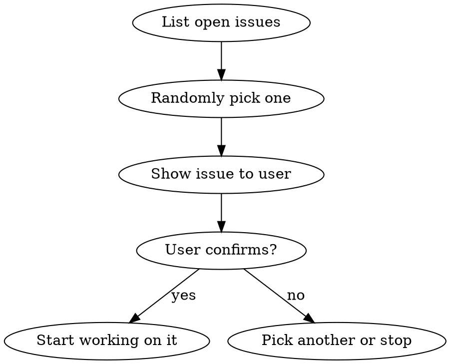

# Random Issue

## Overview

Randomly select an open GitHub issue from the current repository and start working on it. Useful when you want to make progress but aren't sure what to tackle next.

## Workflow



1. **Fetch issues**: Use `gh issue list` to get all open issues in the current repo
2. **Random selection**: Pick one at random using `shuf` or equivalent
3. **Present to user**: Show the issue title, number, labels, and body summary
4. **Get confirmation**: Ask the user if they want to work on this issue or re-roll
5. **Execute**: If confirmed, read the full issue, create a feature branch, and start implementation

## Implementation

```bash
# List all open issues and randomly pick one
gh issue list --state open --limit 100 --json number,title,labels,body | jq '.[randint]'
```

After selection, use `gh issue view <number>` to get full details, then proceed with normal development workflow (branch, implement, test, commit).

## Quick Reference

| Step | Command |
|------|---------|
| List issues | `gh issue list --state open --limit 100 --json number,title,labels,body` |
| Pick random | Pipe through `jq` with random index |
| View details | `gh issue view <number>` |
| Create branch | `git checkout -b feat/<issue-slug>` |

## When NOT to Use

- When the user has a specific issue in mind
- When there are no open issues
- In repos without GitHub issue tracking
