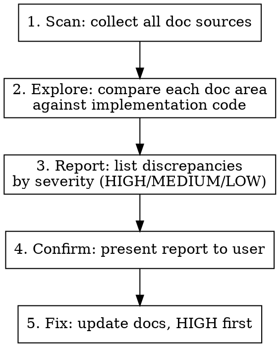

# Update Documentation

Systematically compare implementation against all documentation, identify discrepancies, and fix them.

## When to Use

- After adding/changing features, commands, or UI
- Before releases or version bumps
- When user asks "do the docs match the code?"
- After a batch of PRs merged without doc updates

## Process

### 1. Scan — Identify all doc sources and spec sources

Collect every place that documents behavior:

- `README.md` (project root)
- `CLAUDE.md` (if it documents architecture or data model)
- `docs/` site content (Starlight, Docusaurus, etc.)
- Inline help strings in CLI code (Cobra `Short`/`Long`/`Use` fields)
- Man pages, changelog, or other generated docs

Also collect formal specifications as a source of truth:

- `openspec/specs/*/spec.md` — Each spec defines requirements with scenarios that describe expected behavior. These are the canonical reference for what a feature should do and how it should work.

### 2. Explore — Compare docs against code

Use an Explore agent for thorough comparison. Check these areas:

| Area | What to compare |
|------|----------------|
| **Commands / CLI** | Every command in code has a doc page; flags and args match |
| **UI / TUI** | Panel count, keybindings, layout descriptions match code |
| **Data model** | Schema fields, property types, directory structure match |
| **API / MCP tools** | Tool names, parameters, return fields match |
| **Architecture** | Directory listing matches actual directories; planned vs existing |
| **Config / init** | Documented behavior matches edge cases (already-init, errors) |
| **Specs → Docs** | Every requirement in `openspec/specs/*/spec.md` has corresponding documentation; scenario descriptions match doc descriptions |
| **Specs → Code** | Every requirement in specs is actually implemented; code behavior matches scenario expectations |

**Key patterns to catch:**

- New feature implemented but not documented at all
- Description says X (e.g. "two-panel") but code does Y (three-panel)
- Doc lists partial fields when code returns more
- Flags or options exist in code but missing from docs
- Behavioral nuance undocumented (e.g. `--both` only works with `bidirectional: true`)
- Spec requirement exists but has no corresponding documentation page or section
- Spec scenario describes behavior that contradicts what docs say
- Spec has been updated (new requirements added) but docs still reflect the old version

### 3. Report — Categorize discrepancies

| Severity | Criteria |
|----------|----------|
| **HIGH** | Feature exists in code with zero documentation; doc description is factually wrong |
| **MEDIUM** | Incomplete docs (missing flags, partial field lists); missing preconditions for behavior |
| **LOW** | Minor omissions (error messages, edge case behavior); cosmetic inaccuracies |

Present as a table: severity, file location, problem description.

### 4. Confirm — Get user approval

Show the full report to the user before making changes. The user decides scope: all issues, HIGH only, specific files, etc.

### 5. Fix — Update docs in priority order

- **HIGH first**: Create missing pages, fix factually wrong descriptions
- **MEDIUM next**: Add missing flags/fields, clarify preconditions
- **LOW last**: Fill in edge cases, minor corrections

When creating new doc pages, follow the existing conventions:
- Match frontmatter format (title, description, sidebar order)
- Match tone and detail level of sibling pages
- Place in correct directory with correct sidebar ordering

## Common Mistakes

| Mistake | Fix |
|---------|-----|
| Only checking README, missing docs site | Scan ALL doc sources in step 1 |
| Checking docs but not CLI help strings | Cobra `Short`/`Long` fields are docs too |
| Fixing docs without reading the actual code | Always read implementation before editing docs |
| Updating one location but not others | Same info may appear in README, docs site, and CLAUDE.md — update all |
| Creating doc pages without matching sibling conventions | Check frontmatter, sidebar order, tone of existing pages first |
| Ignoring `openspec/specs/` as a source of truth | Specs define canonical requirements — always cross-check against them |
| Assuming docs are correct when spec disagrees | Spec is the authority; if they conflict, docs should be updated to match spec |
