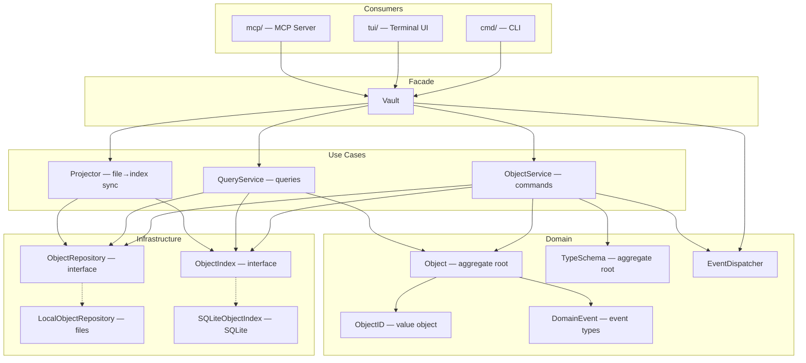
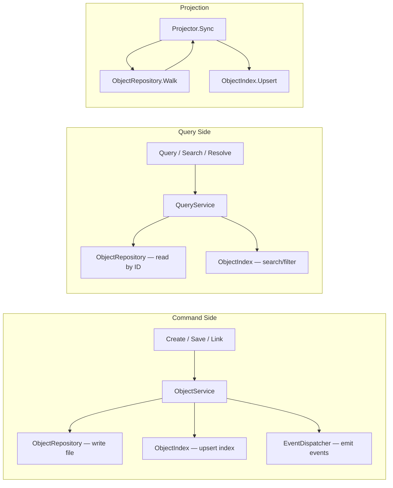

# CLAUDE.md

## Project Overview

typemd is a local-first CLI knowledge management tool. Objects (books, people, ideas) are stored as Markdown files with YAML frontmatter, connected by Relations. SQLite provides indexing.

## Architecture

- **core/** — Core library: objects, types, relations, index
- **cmd/** — CLI commands (Cobra)
- **tui/** — Terminal UI (Bubble Tea)
- **mcp/** — MCP server
- **web/** — Web UI: React + shadcn/ui (future)
- **app/** — Desktop app via Wails + shared React frontend (future)
- **websites/** — Non-Go websites (site, docs, blog)
- **marketplace/** — Claude Marketplace plugins (future)

## Core Package Architecture

The `core/` package follows **Clean Architecture** with **CQRS** (Command Query Responsibility Segregation). The design separates concerns into layers with clear dependency rules.

### Layer Diagram



### CQRS Flow



### Key Design Decisions

- **ObjectRepository** returns domain entities (`*Object`, `*TypeSchema`), not raw bytes. Path conventions and serialization are encapsulated in implementations.
- **ObjectIndex** returns `ObjectResult` (lightweight projection) for search results. Full entity retrieval goes through `ObjectRepository.Get(id)`.
- **Vault** is a thin facade / DI container. Object business logic lives in `ObjectService` (commands) and `QueryService` (queries). Type schema CRUD (`SaveType`, `DeleteType`, `CountObjectsByType`) lives directly on Vault since it delegates to `ObjectRepository` without needing a separate service layer.
- **Domain Events** follow "entity produces → use case dispatches" pattern. Entity methods return `DomainEvent`; services collect and dispatch after successful operations.
- **Files are the source of truth**. SQLite index is an acceleration layer maintained by the `Projector`.

### Key Files

| File | Role |
|------|------|
| `object.go` | Object entity (aggregate root) + Vault facade methods |
| `object_id.go` | ObjectID value object |
| `object_repository.go` | ObjectRepository interface |
| `object_index.go` | ObjectIndex interface + ObjectResult |
| `object_service.go` | ObjectService (command use cases) |
| `query_service.go` | QueryService (query use cases) |
| `local_object_repository.go` | LocalObjectRepository (file I/O) |
| `sqlite_object_index.go` | SQLiteObjectIndex (SQLite queries) |
| `projector.go` | Projector (file→index sync) |
| `domain_event.go` | Domain event types + EventDispatcher |
| `vault.go` | Vault facade + lifecycle (Open/Close/Init) |
| `type_schema.go` | TypeSchema entity + validation + YAML serialization + version handling (DefaultSchemaVersion, CompareVersions) + Vault type CRUD (SaveType/DeleteType/CountObjectsByType) |
| `doctor.go` | Doctor health check: RunDoctor orchestrator, DoctorReport, issue categories |
| `doctor_orphan.go` | OrphanDir scanning for objects/ and templates/ without type schemas |
| `starters.go` | Embedded starter type templates (idea/note/book) + StarterTypes() + Vault.WriteStarterTypes() |
| `vault_config.go` | VaultConfig struct + YAML loading + WriteConfig + DefaultType() + GetConfigValue/SetConfigValue/ConfigKeys (key registry) |
| `slugify.go` | Slugify() function for converting natural-language names to valid slugs |

### TUI Architecture

The TUI uses a three-panel layout (sidebar, body, properties) with a **right panel mode** system:

- `panelEmpty` — no content selected
- `panelObject` — object detail view (body + properties)
- `panelTypeEditor` — type schema editor (independent sub-model `typeEditor` in `tui/type_editor.go`)

The right panel automatically follows the sidebar cursor: moving to an object shows its detail, moving to a type header shows the type editor. The `typeEditor` sub-model has its own `Update()`/`View()` methods and internal mode state (view, edit, move, add wizard, delete confirmation, property detail popup).

## Data Model

- Objects identified by `type/<slug>-<ulid>` (e.g. `book/golang-in-action-01jqr3k5mpbvn8e0f2g7h9txyz`)
- All objects have system properties managed by typemd: `name` (preserves original input on creation; auto-populated from slug for pre-slugified names, or from name template if defined), `description` (optional, user-authored), `created_at` (set on creation, immutable), `updated_at` (updated on save, immutable), `tags` (relation to built-in `tag` type, multiple). These appear first in frontmatter in that order. System properties are either **user-authored** (`name`, `description`, `tags` — can be overridden by templates) or **auto-managed** (`created_at`, `updated_at` — cannot be overridden).
- Type schemas: `.typemd/types/*.yaml` (cannot define properties named `description`, `created_at`, `updated_at`, or `tags` — they're reserved system properties; `name` can appear in `properties` with only a `template` field for auto-generated names). Type schemas support optional `plural` (for display in collection contexts), `unique` (to enforce name uniqueness), and `version` (semver-style `"major.minor"` string for schema migration tracking, default `"0.0"`) fields.
- Built-in types: `tag` (🏷️, plural "tags", unique, backs `tags` system property) and `page` (📄, plural "pages", general-purpose content container). Built-in types exist without YAML files, cannot be deleted, but can be overridden by custom `.typemd/types/<name>.yaml`.
- Shared properties: `.typemd/properties.yaml` (optional, defines reusable property definitions referenced via `use` in type schemas)
- Relations defined as properties in type schemas
- Wiki-links: `[[type/name-ulid]]` syntax in markdown body, with backlink tracking
- SQLite index: `.typemd/index.db`
- TUI session state: `.typemd/tui-state.yaml` (persisted on quit, restored on launch; stores `selected_object_id` or `selected_type_name`, expanded groups, scroll offset, panel widths, and props visibility)
- Vault config: `.typemd/config.yaml` (interface-layer namespacing; `cli.default_type` sets the default type for `tmd object create`; `tmd init` always creates this with `default_type: page`)
- Starter type templates: `core/starters/*.yaml` (embedded in binary via `//go:embed`; offered during `tmd init` as opt-in type schemas — idea, note, book)
- Object templates: `templates/<type>/<name>.md` (optional, Markdown files with frontmatter property overrides and body content applied during `tmd object create`; single template auto-applies, multiple templates prompt for selection or use `-t` flag)
- Object files: `objects/<type>/<name>.md`

## Web UI Architecture

- **Shared frontend**: `tmd serve`, try.typemd.io, and desktop app (Wails) share one React + shadcn/ui frontend
- **Storage Interface**: Frontend talks to a `VaultStorage` abstraction
  - `tmd serve` → Go HTTP API (read-write)
  - try.typemd.io → GitHub REST API from browser, no backend (read-only initially, read-write later)
  - Wails → Go bindings (read-write)
- **No SQLite in browser**: try.typemd.io uses in-memory index built from GitHub API responses
- **Design principle**: SQLite is optional acceleration, not a hard dependency — files are always the source of truth

## Language Convention

**English is the primary language** for all project artifacts:

- **Issues** — titles, descriptions, comments
- **Commits** — commit messages and bodies
- **Skills** — skill content in `.claude/skills/`
- **Releases** — release notes and CHANGELOG

Blog posts are the exception: written in Traditional Chinese (zh-tw) first, then synced to English via the `sync-blog` skill.

## Build & Test

```bash
go build ./...
go test ./...
go run ./cmd/tmd [command]
```

## Testing

This project uses two layers of testing:

- **BDD (Godog)** — Define behaviors, establish shared vocabulary, and describe what a feature does from the user's perspective. Gherkin `.feature` files live in `<package>/features/`. BDD scenarios focus on **what**, not implementation details.
- **Unit tests** — Verify precise logic: edge cases, output formats, exact values, error conditions. Traditional Go `testing` style.

When deciding where a test belongs: if it defines a behavior or names a concept, write a BDD scenario. If it validates an implementation detail (e.g. JSON format, lowercase ULID, flag edge cases), write a unit test.

### BDD scope by package

| Package | Testing approach |
|---------|-----------------|
| `core/` | BDD (`core/features/`) + unit tests |
| `tui/`  | BDD (`tui/features/`, planned) + unit tests |
| `web/`  | BDD (`web/features/`, future) |
| `cmd/`  | Minimal — CLI commands delegate to `core/`, covered by core BDD scenarios |
| `mcp/`  | Unit tests — BDD TBD |
