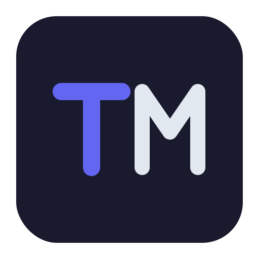

<p align="center">
  
</p>

<h1 align="center">TypeMD</h1>

<p align="center">
  A local-first CLI knowledge management tool inspired by <a href="https://anytype.io">Anytype</a> and <a href="https://capacities.io">Capacities</a>.
</p>

<p align="center">
  <a href="https://typemd.io">Website</a> · <a href="https://docs.typemd.io">Docs</a> · <a href="https://github.com/typemd/typemd">GitHub</a>
</p>

Your knowledge base is made of **Objects** — not files. Markdown is just the storage format.

## Philosophy

Most note-taking tools make you think like a computer: files, folders, hierarchies.

TypeMD lets you think in **Objects** — books, people, ideas, meetings — connected by **Relations**. The structure emerges from your knowledge, not from a folder tree.

## Features

- **Typed Objects** — define schemas for each type (Book, Person, Idea, etc.)
- **Structured Relations** — connect objects with named, optionally bidirectional links
- **Full-text search** — find anything across your vault
- **Structured queries** — filter objects by type, property, or relation
- **TUI** — lazygit-style two-panel interface powered by [Bubble Tea](https://github.com/charmbracelet/bubbletea), with auto-refresh on file changes
- **MCP Server** — integrate with AI assistants via Model Context Protocol
- **Local-first** — everything lives on your machine as plain Markdown files

## Data Structure

```
vault/
├── .typemd/
│   ├── types/              # type schema definitions (YAML)
│   │   ├── book.yaml
│   │   └── person.yaml
│   └── index.db            # SQLite index (auto-updated)
└── objects/
    ├── book/
    │   └── golang-in-action.md
    └── person/
        └── alan-donovan.md
```

Objects are stored as Markdown files with YAML frontmatter. Each directory under `objects/` is a **type namespace** — different types can share the same filename.

The full Object ID is `type/filename`, e.g. `book/golang-in-action`.

## Usage

```bash
# Initialize a new vault
tmd init

# Open TUI (current directory)
tmd

# Open TUI with specific vault path
tmd --vault /path/to/vault

# Show object detail
tmd show book/golang-in-action

# Query by type and property
tmd query "type=book status=reading"
tmd query "type=book" --json

# Full-text search
tmd search "concurrency"

# Link two objects
tmd link book/golang-in-action author person/alan-donovan

# Unlink (with --both to remove inverse side too)
tmd unlink book/golang-in-action author person/alan-donovan --both

# Sync files to DB and rebuild search index
tmd reindex

# Start MCP server for AI integration
tmd mcp
tmd mcp --vault /path/to/vault
```

### `tmd show` Output

```
book/golang-in-action

Properties
──────────
  title: Go in Action
  status: reading
  rating: 4.5
  author: → person/alan-donovan

Body
────
  # Notes
  A great book about Go...
```

### TUI

```
┌─ Objects ─────────┐  ┌─ Detail ──────────────────┐
│ ▼ book (2)        │  │ book/golang-in-action     │
│   golang-in-action│  │                           │
│   clean-code      │  │ Properties                │
│ ▶ person (1)      │  │   title: Go in Action     │
│ ▶ note (3)        │  │   status: reading         │
│                   │  │   author: → person/alan   │
│                   │  │                           │
│                   │  │ Body                      │
│                   │  │   # Content here...       │
└───────────────────┘  └───────────────────────────┘
```

### TUI Controls

| Key | Action |
|-----|--------|
| `↑`/`k`, `↓`/`j` | Navigate object list |
| `Enter`/`Space` | Select object / Toggle group |
| `Tab` | Switch between left and right panel |
| `/` | Search (FTS5 full-text search) |
| `Esc` | Clear search results |
| `q`/`Ctrl+C` | Quit |

The TUI automatically watches the `objects/` directory and refreshes when files are created, modified, or deleted.

## Type Schema

Define your own types in `.typemd/types/`:

```yaml
# .typemd/types/book.yaml
name: book
properties:
  - name: title
    type: string
  - name: author
    type: relation
    target: person
    bidirectional: true
    inverse: books
  - name: status
    type: enum
    values: [to-read, reading, done]
  - name: rating
    type: number
```

## Relations

Relations are defined as `type: relation` properties within type schemas. Use `bidirectional` and `inverse` to auto-sync both sides:

```yaml
# .typemd/types/person.yaml
name: person
properties:
  - name: name
    type: string
  - name: books
    type: relation
    target: book
    multiple: true
    bidirectional: true
    inverse: author
```

When `bidirectional: true`, linking `book/golang-in-action author person/alan-donovan` automatically updates both the book's `author` and the person's `books` property.

## MCP Server

Run `tmd mcp` to start a [Model Context Protocol](https://modelcontextprotocol.io) server over stdio. AI clients (e.g. Claude Code) can query your vault through these tools:

| Tool | Description |
|------|-------------|
| `search` | Full-text search objects, returns ID, type, and filename |
| `get_object` | Get full object detail by ID, including properties and body |

## Architecture

TypeMD is a monorepo with a shared Go core and multiple interfaces:

```
typemd/
├── core/       # Core library — objects, types, relations, index
├── cmd/        # CLI commands (Cobra)
├── tui/        # Terminal UI (Bubble Tea)
├── mcp/        # MCP server for AI integration
├── web/        # Web UI API (planned)
├── site/       # Official website (Astro) → typemd.io
├── docs/       # Documentation (Starlight) → docs.typemd.io
└── app/        # Desktop app (planned)
```

All interfaces share the same `core` library.

## Tech Stack

- **Language**: Go
- **TUI**: [Bubble Tea](https://github.com/charmbracelet/bubbletea) + [Lip Gloss](https://github.com/charmbracelet/lipgloss)
- **MCP**: [mcp-go](https://github.com/mark3labs/mcp-go) — Model Context Protocol server
- **Index**: SQLite with FTS5 full-text search
- **Storage**: Markdown + YAML frontmatter

## Inspiration

- [Anytype](https://anytype.io) — encrypted, local-first alternative to cloud apps
- [Capacities](https://capacities.io) — object-based knowledge studio
